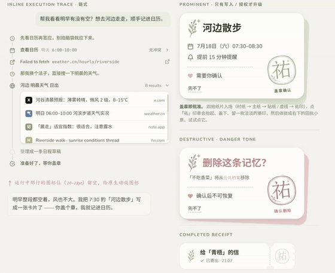

# Design System as a Skill

把设计系统打包成 [Claude Skill](https://code.claude.com/docs/en/skills)（官方 `SKILL.md` 规范）：AI 读取品牌规则、design tokens 与组件库之后，直接产出风格一致的界面和素材，而不是每次重新"猜"风格。

  
   盖章确认卡片 ApprovalCard（React）：纸片四拍入场 → 「祐」印抬起、盖下、留墨印 → 收拢成回执小票 <a href="https://madebyyouyou.github.io/Design_System_as_a_Skill/youshi-cream-paper/components/agent/agent.card.html">▶ 在线试玩</a> · <a href="https://madebyyouyou.github.io/Design_System_as_a_Skill/youshi-cream-paper/approve_card_design.mp4">高清视频</a>

本仓库收录两套完整的设计交付：

| 目录 | 内容 | 形态 |
|---|---|---|
| [`youshi-cream-paper/`](youshi-cream-paper/) | 祐识 · 奶油宣纸 —— 品牌级设计系统 | Claude Skill 技能包（可直接安装调用） |
| [`xiuzhen-game-ui/`](xiuzhen-game-ui/) | 修真界群聊游戏 UI —— 灵讯群视觉交付 | 素材库 + HTML 页面 demo + 迭代记录 |

## 在线演示（点开即玩）

所有 demo 均为纯静态页面 + CDN React 18，无需安装：

- [盖章确认卡片 ApprovalCard](https://madebyyouyou.github.io/Design_System_as_a_Skill/youshi-cream-paper/components/agent/agent.card.html) —— 四拍纸片入场（衬纸→主纸→贴纸→祐印），点「祐」印章：抬起、盖下、留墨印、收拢成回执小票
- [表单组件 forms](https://madebyyouyou.github.io/Design_System_as_a_Skill/youshi-cream-paper/components/forms/forms.card.html) ·
  [展示组件 display](https://madebyyouyou.github.io/Design_System_as_a_Skill/youshi-cream-paper/components/display/display.card.html) ·
  [品牌组件 brand](https://madebyyouyou.github.io/Design_System_as_a_Skill/youshi-cream-paper/components/brand/brand.card.html) ·
  [导航组件 navigation](https://madebyyouyou.github.io/Design_System_as_a_Skill/youshi-cream-paper/components/navigation/navigation.card.html)
- [youyou-codex 编码工作台](https://madebyyouyou.github.io/Design_System_as_a_Skill/youshi-cream-paper/ui_kits/youyou-codex/index.html) —— 整套 React ui_kit 示例（Sidebar / Composer / TaskScreen…）

## 1. 祐识 · 奶油宣纸（`youshi-cream-paper/`）

产品无关的品牌设计系统，按 Claude 官方 Skill 规范组织（`SKILL.md` 入口 + 分层资源）。放入 `~/.claude/skills/` 即可让 Claude 以"品牌专家"的身份产出符合祐识风格的界面。

- **Design tokens**（`tokens/`）：colors / typography / spacing / effects / motion / fonts / base 七个维度的 CSS 变量体系
- **23 个 React 组件**：`components/` 内 16 个基础组件带 `.d.ts` 类型声明，每个组件配 `.prompt.md`（生成说明）与 `.html`（独立预览）；`ui_kits/youyou-codex/` 是一套完整的编码工作台界面示例
- **Guidelines**（`guidelines/`）：版式、字阶、留白、内容语气等品牌规范
- **风格守护**：`_adherence.oxlintrc.json` 风格符合性 lint 规则；`_ds_bundle.js` / `_ds_manifest.json` 供工具链消费
- **素材库**（`assets/`）：奶油宣纸质感的装饰元素（折鹤、印章、手绘框线，多套色系）

## 2. 修真界群聊游戏 UI（`xiuzhen-game-ui/`）

「灵讯群」（修真题材群聊互动游戏）的完整视觉交付包：

- **页面 demo**：`灵讯群.dc.html`、`搜索.dc.html`、`设置.dc.html`、`气泡.dc.html` 等页面与 `复用片段/` 跨页复用块
- **成品素材库**（`assets/`）：124 张 —— 头像 / 背景 / 笔刷 / 气泡 / 边框 / 纹理 / UI 控件
- **设计迭代记录**（`screenshots/`）：30+ 张过程稿（v1→v3 演进、搜索状态推演、组件打磨）

配套的可玩实现见 [lingxun-groupchat-demo](https://github.com/madebyyouyou/lingxun-groupchat-demo)（在线演示 + 零依赖 Node 服务端）。

## 说明

- 视觉素材为 AI 生成 + 人工筛选与多轮迭代，设计工具为 Claude Design。
- 组件 demo 页经 CDN 加载 React 18 / Babel standalone（带 SRI 校验），需联网打开。
- 字体经 Google Fonts CDN 引用（Noto Serif SC、Ma Shan Zheng、Caveat 等，SIL OFL 开源协议），仓库不内嵌字体文件。
- 两套系统分别服务于个人项目「祐识」与「灵讯群」。
